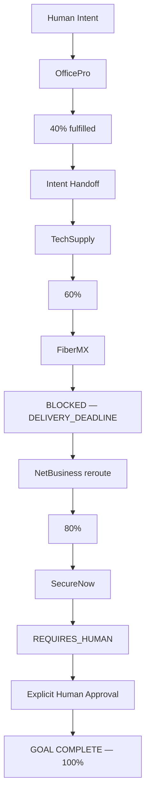

# NEXUS

> **The continuity layer for the Agentic Web.**
>
> **Websites end. Human intentions don't.**

WebMCP gives agents tools inside a website. **NEXUS lets the user's intent continue beyond it.**

NEXUS is an open-source, WebMCP-first proof of concept for the OpenAI WebMCP Challenge.
It preserves a user's remaining goal across independent agent-ready providers, makes
failure and recovery visible, and requires explicit human approval before commitments.

## Live Demo / Evidence

- **Live demo:** [https://nexus.1expert.pro](https://nexus.1expert.pro)
- **Public repository:** [https://github.com/4040apps/Nexus](https://github.com/4040apps/Nexus)

| Evidence | Result |
| --- | --- |
| Native WebMCP | 16 genuine provider-owned WebMCP tools |
| Provider independence | 5 independent providers across 6 HTTPS origins |
| Cross-origin execution | WebMCP tool discovery and invocation validated end to end |
| Recovery | FiberMX failure preserved; internet rerouted to NetBusiness |
| Human control | Explicit approval required for commitment-class actions |
| End-to-end proof | ChatGPT hero mission validated through Goal Complete |
| Final mission | MXN 410,000 used / MXN 90,000 remaining; deadline satisfied |
| Agent Readiness | 39 → 61 → **66** (+27 points / +69.2%); WebMCP **5/5** |
| Production Lighthouse | **100** Performance / **100** Accessibility / **100** Best Practices / **100** SEO |

## Why NEXUS

Websites and providers have boundaries; human goals often do not. A furniture provider
may complete one part of opening an office, while computers, connectivity, and security
still require other independent providers.

NEXUS carries only the remaining intent and necessary constraints across those boundaries.
It preserves provider ownership, records blocked paths, reroutes unresolved work, and
keeps the human in control of every commitment.

## Hero mission

> Open an office for 20 people in Guadalajara before October 1, 2026 with a MXN $500,000 budget.



## Brand Mode and Broker Mode

NEXUS does not silently divert a user away from a provider. A user who deliberately
starts on a provider site remains in **Brand Mode**. Continuation to other providers
requires an explicit Intent Handoff and user authorization into **Broker Mode**.

## Workspace

```text
apps/
  webmcp-cross-origin-spike/
  nexus/
  officepro/
  techsupply/
  fibermx/
  netbusiness/
  securenow/
packages/
  environment/
  webmcp/
  goal-state/
  intent-handoff/
  provider-template/
docs/
  architecture.md
  webmcp.md
  hackathon.md
  agent-readiness.md
  demo.md
  deployment.md
AGENTS.md
README.md
```

The repository is a pnpm TypeScript workspace. Provider apps share their provider and
WebMCP contracts through `packages/provider-template` and `packages/webmcp`; mission
continuity contracts live in `packages/goal-state` and `packages/intent-handoff`.
Provider-owned catalog, price, stock, and availability data must remain inside each
provider app. The deterministic hero fixtures keep the final mission at MXN 410,000 while
preserving the FiberMX deadline failure, NetBusiness reroute, and SecureNow approval gate.

## Development

Requirements: Node.js 20 or newer and pnpm 11.

```bash
pnpm install
pnpm dev
```

Run the complete foundation quality gates from the repository root:

```bash
pnpm lint
pnpm typecheck
pnpm test
pnpm build
```

Each workspace also exposes `dev`, `typecheck`, and `build` scripts so it can be
worked on independently while consuming the shared contracts via `workspace:*`.

Preview the Mission Dashboard after building the NEXUS package:

```bash
pnpm --filter @nexus/app-nexus build
pnpm --filter @nexus/app-nexus preview:dashboard
```

Open `http://localhost:4400`. Deterministic visual snapshots are selected with the
`state` query parameter: `initial`, `officepro-partial`, `fibermx-blocked`,
`internet-rerouted`, `approval-required`, or `complete`. For example:

```text
http://localhost:4400/?state=approval-required
```

The dashboard renders canonical Goal State directly; the preview snapshots do not execute
provider orchestration or commitment actions.

Run the complete live OfficePro → handoff → TechSupply → FiberMX → NetBusiness → SecureNow
hero on six independent local origins with one canonical command:

```bash
pnpm demo:hero
```

The command builds the required workspace, starts all six origins, checks that each one
responds, and prints the ready URL. A failed or occupied server exits visibly instead of
presenting a partial demo. The short recording walkthrough is in
[`docs/demo.md`](docs/demo.md).

Open `http://localhost:4400` and choose **Ask OfficePro**. NEXUS embeds the independent
OfficePro site from `http://localhost:4500` with `allow="tools"`. In Chrome 151+ launched
with `--enable-features=WebMCP`, NEXUS discovers and invokes the four genuine provider
tools using `document.modelContext`. In a browser without WebMCP, the UI explicitly labels
the normal provider-website fallback; it does not claim WebMCP success. The result is the
canonical 40% Goal State with MXN 155,000 used. Choose **Continue through NEXUS** to create
a minimized `PROPOSED` Intent Handoff, review the remaining intent, and explicitly select
**Authorize NEXUS to continue**. Only the resulting `EXECUTED` handoff enables Broker Mode;
then choose **Find computers**. TechSupply runs independently at `http://localhost:4600`,
exposes `search_computers`, `check_inventory`, and `build_computer_package`, and fulfills 20
computers for MXN 190,000 with delivery on 2026-09-22. The live checkpoint is 60% complete,
MXN 345,000 used, and MXN 155,000 remaining. Choose **Find internet** to invoke FiberMX at
`http://localhost:4700`. Its valid Guadalajara coverage cannot overcome its provider-owned
2026-10-08 installation date, so Goal State visibly records `BLOCKED` /
`DELIVERY_DEADLINE` against the 2026-10-01 deadline without counting the offer toward used
budget. Choose **Recover with another provider** to reroute only internet to NetBusiness at
`http://localhost:4800`. Its 2026-09-25 installation fulfills internet for MXN 27,500;
the checkpoint becomes 80%, MXN 372,500 used, and MXN 127,500 remaining while the FiberMX
failure remains auditable and security stays pending. Snapshot URLs remain available by
adding `?state=<name>`. Choose **Find security** to run SecureNow’s provider-owned READ and
PLAN tools at `http://localhost:4900`. The dashboard stops at `REQUIRES_HUMAN` with 80%
progress and unchanged used budget. Only **Approve and continue** records a proposal-bound
human approval and invokes the commitment-class `request_installation` tool. Success
finishes the mission at 100%, MXN 410,000 used, and MXN 90,000 remaining while the
FiberMX failure, NetBusiness recovery, and SecureNow approval remain visible.
Choose **Reset mission** to clear canonical and provider runtime state and replay the full
flow without restarting the servers. `pnpm demo:officepro` remains a compatibility alias.

Run the Issue #6 cross-origin reproduction harness with `pnpm spike:webmcp`. It starts the
authorized consumer on port 4100, the independent provider on port 4200, and an unauthorized
negative control on port 4300. Exact browser requirements and validated results are in
[`docs/webmcp.md`](docs/webmcp.md#issue-6-spike-result-cross-origin-validated).

The NEXUS package provides maintained `robots.txt`, dated `sitemap.xml`, `llms.txt`,
canonical Markdown, ARD and Agent Skills discovery, linked Schema.org/Open Graph metadata,
substantive public docs, and accessible shell contracts for a configurable deployment
origin. Validate them locally after building the package:

```bash
pnpm --filter @nexus/app-nexus build
pnpm --filter @nexus/app-nexus check:readiness -- https://nexus.your-domain.example
```

Production Agent Readiness improved **39 → 61 → 66** through truthful discovery and
accessibility hardening: **+27 points / +69.2% from baseline**, with WebMCP passing
**5/5**. This is not a claim of >=95; NEXUS deliberately does not fabricate API, OAuth,
MCP-server, A2A, SDK, CLI, pricing, or payment surfaces to raise a generic score.
Final production Lighthouse is **100 Performance, 100 Accessibility, 100 Best Practices,
and 100 SEO**. The evidence policy, exact findings, accessibility checklist, deliberately
absent surfaces, and measurement history are in
[`docs/agent-readiness.md`](docs/agent-readiness.md#targets-and-measured-baseline).

## Cloudflare production deployment

The existing six-origin architecture has a separate, explicit Cloudflare Workers Static
Assets deployment path. Normal `pnpm build` and `pnpm demo:hero` remain local and never
publish. Production commands are:

```bash
pnpm build:production
pnpm exec wrangler login
pnpm deploy:production
pnpm verify:production
```

The production build fails closed unless all six configured origins are exact HTTPS
origins, every provider exposes tools only to `https://nexus.1expert.pro`, NEXUS discovery
uses the five independent provider origins, and generated assets contain no localhost or
HTTP origin. Account authentication and custom-domain attachment are deliberately manual.
See [`docs/deployment.md`](docs/deployment.md) for the audited worker/domain mapping and
the exact post-merge steps.

## Sprint 0

Sprint 0 establishes the contracts and guardrails Codex must follow before feature implementation begins. See the Sprint 0 pull request and GitHub Issues for the executable backlog.

## Non-goals for the hackathon

- Building a global WebMCP search engine.
- Inventing a new distributed protocol or identity standard.
- Real procurement integrations or production payments.
- Large catalogs or production supplier onboarding.
- Hiding provider failures in the demo.

The proof of concept is intentionally optimized for a clear, reliable three-minute demonstration of continuity across agent-ready websites.
