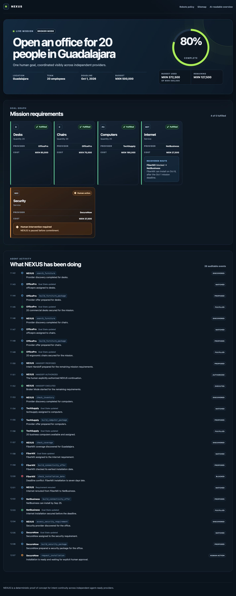

# NEXUS Architecture

## Deployment environments

The shared `@nexus/environment` contract owns the complete `LOCAL` and `PRODUCTION`
origin maps. Local development uses six HTTP localhost origins; production uses the six
exact HTTPS subdomains under `1expert.pro`. Browser bundles receive one validated map at
build time, so production assets cannot silently fall back to localhost. Cloudflare serves
each app as a separate Workers Static Assets deployment; this changes hosting only, not
the provider/NEXUS responsibility boundary. See [deployment.md](deployment.md).

## Thesis

NEXUS is the continuity layer between independent agent-ready websites. The unit of continuity is the user's **Goal State**, not a browser page or a provider session.

```text
HUMAN INTENT
    |
    v
Provider A / WebMCP
    |
    | partial fulfillment
    v
Intent Handoff (explicit consent)
    |
    v
NEXUS Registry + Goal State
    |
    +--> Provider B / WebMCP
    +--> Provider C / WebMCP
    |
    +--> blocked provider -> reroute
    |
    v
Human approval for commitment
    |
    v
GOAL COMPLETE
```

## Modes

### Brand Mode
The user deliberately visits a provider. The agent uses that provider's WebMCP capabilities and does not silently divert equivalent demand to competitors.

### Broker Mode
The user explicitly authorizes NEXUS to continue unresolved requirements. NEXUS may discover and route remaining needs across providers.

## Goal State contract

```ts
type RequirementStatus =
  | 'PENDING'
  | 'DISCOVERED'
  | 'MATCHED'
  | 'PROPOSED'
  | 'BLOCKED'
  | 'REQUIRES_HUMAN'
  | 'FULFILLED';

type GoalState = {
  id: string;
  goal: string;
  constraints: {
    city: string;
    employees: number;
    budget: number;
    currency: 'MXN';
    deadline: string;
  };
  requirements: Requirement[];
  budgetUsed: number;
  budgetRemaining: number;
  progress: number;
  activity: ActivityEvent[];
};

type Requirement = {
  id: string;
  type: string;
  quantity?: number;
  status: RequirementStatus;
  providerId?: string;
  estimatedCost?: number;
  blocker?: {
    code: string;
    message: string;
  };
  approval?: {
    required: boolean;
    approved: boolean;
  };
  failureHistory?: Array<{
    providerId?: string;
    blocker: {
      code: string;
      message: string;
    };
    activityEventId: string;
    occurredAt: string;
  }>;
};
```

The implementation may refine this TypeScript shape, but semantic changes require documentation and tests.

`budgetUsed` is derived from the estimated cost of `FULFILLED` requirements only;
proposals and pending approvals are not commitments. `budgetRemaining` is the goal
budget minus that derived amount. `progress` is the rounded percentage of requirements
whose status is `FULFILLED` (or `0` when there are no requirements).

State changes are immutable. The caller supplies stable event IDs and timestamps so
each material transition can append a deterministic, auditable `ActivityEvent`.

## Mission Dashboard presentation boundary

The NEXUS Mission Dashboard is a pure, framework-independent presentation layer over
canonical `GoalState`:

```text
GoalState
   |
   v
MissionDashboard
   +-- MissionSummary + MissionProgress
   +-- GoalGraph
   |    `-- RequirementCard
   `-- AgentActivityTimeline
```

The renderer reads mission constraints, derived progress and budget metrics, requirement
statuses, provider assignments, costs, blockers, approvals, failure history, and activity
events directly from Goal State. It does not mutate the mission and does not define a
UI-specific mission model. Current mode is presented only when canonical state supports
the inference: an OfficePro assignment indicates Brand Mode, while an executed Intent
Handoff activity event indicates Broker Mode.

Six deterministic Goal State snapshots exercise the presentation without implementing
orchestration: initial, OfficePro partial fulfillment, FiberMX blocked, internet rerouted,
SecureNow awaiting approval, and complete. These snapshots use the existing Goal State
and Intent Handoff state machines. Costs stored in them represent provider results already
recorded in Goal State; they are not a NEXUS provider catalog.

The activity timeline sorts and renders canonical activity events. Optional event details
may provide a provider tool name and human-readable summary, allowing WebMCP invocation,
deadline failure, reroute, approval, and fulfillment moments to be legible without adding
new activity action types or hard-coded static timeline markup.



### OfficePro Brand Mode runtime

The first live hero segment uses two independent local origins:

```text
NEXUS consumer/dashboard : http://localhost:4400
             | iframe allow="tools"
             v
OfficePro provider       : http://localhost:4500
```

OfficePro registers only `analyze_office_requirement`, `search_furniture`,
`build_furniture_package`, and `check_delivery` for this segment. The WebMCP path uses
`getTools({ fromOrigins: ['http://localhost:4500'] })` and `executeTool()` from the NEXUS
origin; OfficePro registers with `exposedTo: ['http://localhost:4400']`. The normal provider
page invokes the same provider-owned tool definitions when WebMCP is unavailable and the
dashboard labels that transport as a website fallback. No provider REST proxy is added.

NEXUS validates typed tool results before changing canonical Goal State. It persists only
the assignments, per-requirement totals, delivery confirmation summary, and auditable
activity needed by the mission. Catalog identifiers, unit prices, stock records, package
identifiers, and the provider's complete result objects stay inside OfficePro.

The successful runtime applies `PENDING -> DISCOVERED -> MATCHED -> PROPOSED -> FULFILLED`
to desks and chairs, producing 40% progress and MXN 155,000 used / MXN 345,000 remaining.
Computers, internet, and security remain unassigned and `PENDING`. The UI offers
**Continue through NEXUS**. Selecting it now creates a `PROPOSED` Intent Handoff and shows
the minimized payload before asking for explicit human authorization. Authorization and
execution append the canonical audit events; only the executed handoff changes the visible
mode to Broker Mode. TechSupply routing begins only from that executed state.

## Intent Handoff contract

An Intent Handoff has three explicit lifecycle stages:

```text
PROPOSED (Brand Mode, not authorized)
  -> AUTHORIZED (explicit human consent recorded)
  -> EXECUTED (Broker Mode routing may begin)
```

The proposal and authorization records share the same minimized continuation data, but
only the executed payload is an `IntentHandoff`:

```ts
type IntentHandoff = {
  handoffId: string;
  goalId: string;
  status: 'EXECUTED';
  source: {
    providerId: string;
    mode: 'BRAND';
  };
  destination: {
    type: 'NEXUS';
    mode: 'BROKER';
  };
  authorizedByUser: true;
  authorization: {
    required: true;
    approved: true;
    approvedAt: string;
  };
  executedAt: string;
  constraints: {
    city: string;
    deadline: string;
    remainingBudget: number;
    currency: 'MXN';
  };
  remainingRequirements: Array<{
    id: string;
    type: string;
    quantity?: number;
  }>;
};
```

The payload is projected from Goal State rather than copying Goal State wholesale.
Fulfilled requirements, provider assignments, estimates, blockers, catalogs, stock,
prices, activity history and unrelated customer/provider data are not transferred.
Broker routing is allowed only for a validated `EXECUTED` handoff with explicit approval.

The Goal State timeline records `HANDOFF_PROPOSED`, `HANDOFF_AUTHORIZED`, and
`HANDOFF_EXECUTED` as goal-level audit events; these do not change requirement statuses.

The live OfficePro continuation uses that lifecycle directly:

```text
Continue through NEXUS
  -> PROPOSED (approval UI; Brand Mode; routing locked)
  -> explicit human authorization
  -> AUTHORIZED (routing still locked)
  -> EXECUTED (Broker Mode enabled; routing allowed)
```

The payload contains only computers, internet, and security plus Guadalajara, the mission
deadline, MXN 345,000 remaining, and the currency. It excludes fulfilled furniture,
employee count, provider assignments, catalog/item/package identifiers, stock, unit prices,
complete provider results, and activity history.

### TechSupply Broker Mode runtime

Issue #21 continues the same live Goal State from the executed handoff. NEXUS selects
TechSupply using only the thin `computer` category, Guadalajara service area, origin, and
three capability names. Before any invocation it requires
`canBeginBrokerRouting(handoff) === true`; a proposed or merely authorized handoff fails
closed.

```text
NEXUS consumer/dashboard : http://localhost:4400
             | iframe allow="tools"
             v
TechSupply provider      : http://localhost:4600
```

TechSupply registers `search_computers`, `check_inventory`, and
`build_computer_package` with `document.modelContext` and exposes them only to NEXUS. The
consumer discovers them with `getTools({ fromOrigins: ['http://localhost:4600'] })` and
invokes them with `executeTool()`. If WebMCP is unavailable, the visibly labelled normal
TechSupply page invokes the same provider-owned definitions. The commitment-class
`request_quote` tool is not exposed or invoked by this segment.

All search, inventory, package, quantity, price, currency, and deadline facts are validated
before canonical Goal State changes are returned. Invalid facts throw a typed error and
leave the caller's 40% post-handoff state unchanged. The successful path records
`PENDING -> DISCOVERED -> MATCHED -> PROPOSED -> FULFILLED` for computers, then reaches
60% with MXN 345,000 used / MXN 155,000 remaining. Goal State retains only the TechSupply
assignment, MXN 190,000 mission cost, delivery summary, and audit events; item/package IDs,
stock records, unit price, and complete results remain provider-owned. Internet and
security stay unassigned and `PENDING`; Issue #22 begins internet routing.

### FiberMX failure and NetBusiness recovery runtime

Issue #22 continues only from the canonical 60% post-TechSupply state and the executed
Intent Handoff. NEXUS selects both internet providers from thin `internet` category,
Guadalajara service-area, origin, and capability metadata.

```text
NEXUS consumer/dashboard : http://localhost:4400
             | iframe allow="tools"
             +--> FiberMX provider     : http://localhost:4700
             `--> NetBusiness provider : http://localhost:4800
```

Each independent provider registers `check_coverage`, `check_installation_date`, and
`build_connectivity_offer` with `document.modelContext`, uses
`exposedTo: ['http://localhost:4400']`, and owns its coverage, date, offer identifier,
price, and constraint logic. NEXUS discovers through exact `fromOrigins` and validates all
tool results before returning a Goal State change. The normal provider page invokes the
same definitions when WebMCP is unavailable and the dashboard labels that fallback.

**Find internet** moves internet through `PENDING -> DISCOVERED -> MATCHED -> PROPOSED ->
BLOCKED`. FiberMX coverage is valid, but its 2026-10-08 installation misses the 2026-10-01
human deadline. Goal State records `DELIVERY_DEADLINE`, the provider assignment, failure
history, and activity; the uncommitted MXN 24,000 proposal is not included in budget used.
The UI stops on this blocked state until the user selects **Recover with another provider**.

Recovery invokes NetBusiness before changing canonical state. Its 2026-09-25 installation
meets the deadline. The existing `rerouteRequirement` transition performs `BLOCKED ->
MATCHED`, clears only the current blocker, and preserves the FiberMX blocker in
`failureHistory` and the reroute event. NetBusiness then moves through `PROPOSED ->
FULFILLED` at MXN 27,500. The checkpoint is 80% complete, MXN 372,500 used, MXN 127,500
remaining; security alone remains unassigned and `PENDING`. SecureNow is outside Issue #22.

### SecureNow human approval runtime

Issue #23 starts only from the canonical 80% post-NetBusiness Goal State and the executed
Intent Handoff. NEXUS discovers SecureNow through thin security capability metadata and
embeds its independent origin:

```text
NEXUS consumer/dashboard : http://localhost:4400
             | iframe allow="tools"
             v
SecureNow provider       : http://localhost:4900
```

SecureNow registers `assess_security_requirement` (READ), `build_security_package` (PLAN),
and `request_installation` (COMMIT) with `document.modelContext` and
`exposedTo: ['http://localhost:4400']`. Assessment, package/service identifiers, contents,
availability, pricing, installation details, and commitment execution stay provider-owned.
NEXUS persists no package or confirmation identifier.

**Find security** invokes only READ/PLAN. After validating the MXN 37,500 proposal and Sep
27 installation, NEXUS records `PENDING -> DISCOVERED -> MATCHED -> PROPOSED ->
REQUIRES_HUMAN` and stops at 80% / MXN 372,500 used. The earlier Intent Handoff authorizes
Broker Mode, not this commitment. `request_installation` has zero invocations at this stop.

**Approve and continue** creates one canonical `REQUIREMENT_APPROVAL_RECORDED` event while
security remains `REQUIRES_HUMAN`. Its approval binds goal, requirement, provider,
expected MXN 37,500 total, currency, action, and stable proposal scope. Only then is
`request_installation` invoked on the SecureNow origin. A validated result applies
`REQUIRES_HUMAN -> FULFILLED`, reaching 100%, MXN 410,000 used, and MXN 90,000 remaining.
Malformed or stale approval and malformed provider results fail closed. The final Goal
State still preserves the FiberMX failure history and NetBusiness recovery activity.

### Complete hero demo hardening

`pnpm demo:hero` is the canonical Sprint 1 entry point. A small Node launcher starts the
six compiled HTTP servers, polls their exact origins, and declares readiness only after all
respond. It terminates the group when a required server fails; no container platform,
proxy, or new persistence layer is involved.

The browser runtime permits only one judge action in flight. Every re-rendered control is
disabled while that action settles, preventing rapid clicks from duplicating transitions
or invoking the SecureNow commitment twice. Provider errors preserve the last valid Goal
State and expose only state-appropriate retries. A commitment retry reuses the recorded
proposal-bound approval and never weakens the approval check.

**Reset mission** replaces the in-memory Goal State with the canonical initial fixture and
clears the handoff, transport labels, readiness flags, failure history, approval, and
ephemeral proposal handles. Re-rendering removes and recreates the independent provider
iframes, giving each provider page a fresh runtime context without restarting its server.
No snapshot query parameter participates in the live flow.

## Registry contract

NEXUS registry is intentionally thin:

```ts
type ProviderRegistryEntry = {
  id: string;
  name: string;
  origin: string;
  categories: string[];
  serviceAreas: string[];
  capabilities: string[];
  agentReadiness?: {
    score?: number;
    source: 'external' | 'demo';
  };
};
```

Prices, stock, installation slots and catalogs remain provider-owned and are queried through provider capabilities.

## Demo providers

- OfficePro — desks/chairs; initial Brand Mode provider.
- TechSupply — computers.
- FiberMX — internet; deliberately fails the deadline constraint.
- NetBusiness — internet fallback; succeeds before deadline.
- SecureNow — security; requires human approval before commitment.

Synthetic provider data should create meaningful tradeoffs rather than a trivial all-success path.

### Deterministic hero fixtures

Each provider app owns its own minimal fixture data and exposes it through genuine
provider-template tools. NEXUS may retain only the thin discovery metadata derived from
those tools; it does not store these prices, stock levels, or dates.

| Provider | Deterministic behavior | Mission cost |
| --- | --- | ---: |
| OfficePro | 20 desks for MXN 80,000 and 20 chairs for MXN 75,000; delivery 2026-09-20 | MXN 155,000 |
| TechSupply | 20 business laptops in stock; delivery 2026-09-22 | MXN 190,000 |
| FiberMX | Guadalajara coverage, but earliest installation 2026-10-08 produces `BLOCKED` / `DELIVERY_DEADLINE` | Not committed |
| NetBusiness | Guadalajara coverage and installation 2026-09-25 after reroute | MXN 27,500 |
| SecureNow | Package installation 2026-09-27; commitment pauses at `REQUIRES_HUMAN` until approval | MXN 37,500 |

The approved final mission cost is exactly MXN 410,000, leaving MXN 90,000 of the
MXN 500,000 budget. The FiberMX blocker remains in requirement failure history after the
NetBusiness reroute, and the SecureNow approval remains in the requirement and activity
timeline.

## State transitions

```text
PENDING
  -> DISCOVERED
  -> MATCHED
  -> PROPOSED
       |-> BLOCKED -> REROUTE -> MATCHED
       |-> REQUIRES_HUMAN -> FULFILLED
       `-> FULFILLED
```

Every material transition should append an ActivityEvent so the UI can explain what the agent did and why.

## Failure and recovery

Failures are structured outcomes, not exceptions hidden from the mission UI. Example:

```json
{
  "status": "BLOCKED",
  "providerId": "fibermx",
  "code": "DELIVERY_DEADLINE",
  "availableDate": "2026-10-08",
  "requiredBy": "2026-10-01"
}
```

NEXUS should preserve the failure in the timeline and reroute only the unresolved requirement.
When a blocked requirement is rerouted, its current blocker is cleared as it returns to
`MATCHED`, while the structured blocker remains in `failureHistory` and in the reroute
timeline event.

## Human approval boundary

Read/search/availability/planning operations may execute autonomously. Actions that create a material commitment must return `REQUIRES_HUMAN` before execution.

## Technical risk

Cross-origin WebMCP is the primary integration risk. Implement the simplest stable authorized-origin/container path first. Do not fake provider independence by moving all provider behavior behind NEXUS REST endpoints.
